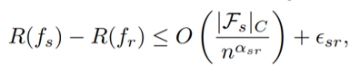
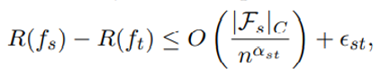
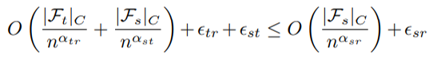

# Improved Knowledge Distillation via Teacher Assistant

### The Thirty-Fourth AAAI Conference on Artificial Intelligence (AAAI-20)

이정수

- ## **Abstract**

  - 지식 증류 과정에서 교사(Teacher) 모델과 학생(Student) 모델 사이에 TA(Teacher Assistant) 모델을 삽입하여 Size Gap에서 오는 손실을 줄임
  
  - 본 논문에서는 최적의 TA 모델 사이즈를 실험적으로 밝혔고, TA 모델을 다수 사용하는 multi-step distillation을 제안함
  
  - 실험 결과, Normal Knowledge Distillation은 물론 다른 증류 방법들보다 높은 정확도 향상을 보임
  

- ## Background, Problem

  - 지식 증류란, 훈련된 거대 모델(이하 교사 모델)의  output data를 작은 모델(이하 학생 모델)의 label로 사용함으로써 학생 모델을 보다 효율적으로 훈련하는 방법. 이때 손실 함수는 

    1. student model output 과 ground truth  *Yr*의 cross-entropy인 term *Student Loss*
    2. teacher soft output인 *Yt*와 student soft output인 *Ys* 의 KL-Divergence 값에 증류상수 *T* 제곱을 곱한 term *Knowledge Distillation Loss*로 구성됨.

    

    
    

  - 학생 모델의 loss는 raw data를 직접 학습하며 얻는 오차 항과, 교사 모델이 넘겨주는 soft label을 학습하며 얻는 오차 항의 합으로 이루어져 있음. 이때 교사 모델이 크다고 무조건 낮은 loss를 얻는것이 아니고, 두 모델 크기의 관계에 따라 최적의 distillation point가 결정됨

  - Figure 2. 의 실험에 따르면 교사 모델의 크기와 정확도는 선형적으로 증가하는데 반해, 증류받는 학생 모델의 정확도는 어느 시점에 다다르면 다시 낮아지는 현상을 보임. 이 실험으로 교사 모델의 성능이 학생 모델의 성능을 보장하지 않음을 정량적으로 측정함.

     

    

  - 논문은 세가지 Factor로 이 현상을 설명

    1. 교사의 성능이 높아질수록, 학생에게 더 좋은 정보를 전달해줄 수 있음

    2. 교사가 너무 거대해지면, 학생이 증류를 받아도 이를 수용할만한 Capacity가 없을 수도 있음

    3. 정확도가 상승할수록 logit이 덜 soft해져서 증류가 원할하게 이뤄지지 않음

       

  - 1과 2, 3은 상반되는 특성이기 때문에 위 세가지 factor가 최적의 균형을 이루도록 교사와 학생 모델의 size를 조정하여 증류 성능을 높이는 것이 관건

  

- ## Teacher Assistant

  - 그러나 현실적으로 교사나 학생 모두 fixed size model인 경우이거나, size gap이 큰 경우가 많아 최적화를 적용하기 어려움

  - 따라서 교사와 학생 사이에 중간 크기의 Teacher Assistant(이하 TA) 모델을 삽입해 Size gap으로 인한 증류 손실을 완화하는 방법을 제안

  - 교사가 TA에게 증류를 하고, 다시 TA가 학생에게 증류를 하는 방식으로 process가 진행

    

  

- ## Experiment

  1. TA Knowledge Distillation evaluation. 이때 Size의 S는 model에 존재하는 Conv layer의 갯수

     * 다양한 모델과 데이터셋에 실험한 결과, TA 증류를 사용했을때의 결과가 증류를 하지 않은 경우나 일반적인 증류를 한 경우보다 좋은 결과를 보임

       

  
       ​	

  2. Optimal TA Size

     - 실험 결과, 최적의 TA Size는 학생과 교사 모델의 Size의 평균이 아닌, Accuracy의 평균에 존재. Table 2에서 최적의 결과는 모두 Figure 4의 빨간 점선, 즉 교사 모델과 학생 모델 Accuracy의 평균에 위치하는 model size임

      
 

       

       

     - 본 논문에서는 실험적으로는 optimal TA Size를 찾는데는 성공하였지만,  좀 더 체계적이고 이론적인 조사는 future work로 남김. 이는 본 논문이 나오기 반년 전에 나온 EfficientNet의 Compound Scaling의 영향을 받은 것으로 생각됨

       

  3. Multi-Step Knowledge Distillation

     - 다수의 TA 모델을 사용한 결과, TA를 3번으로 가장 많이 사용한 1번째 Path가 가장 좋은 결과를 보임. 본 Figure의 두가지 Point는
       1. 어떤 Size의 TA든 일단 사용하는 경우가 그렇지 않은 경우보다 무조건 좋은 결과를 보임
       2. TA를 한번만 사용한 7번째 Path가, 두번 사용한 2, 3번째 Path보다 더 좋은 결과를 보임. 이는 optimal한 TA Size가 중요한 요소임을 시사

     

     

  4. Generalization

     * 실험 결과, TA 증류의 local minima 근처가 다른 경우보다 더 flat해지는것을 확인할 수 있음. 이는 보다 Generalization이 잘 되었음을 시사

* ## Theoretical Analysis

  * TA 증류가 어떻게 일반적인 증류보다 더 좋은 성능을 가질 수 있는지에 대한 이론적 분석

  * 이를 설명하기 위해 VC theory의 가정에서 출발함.

  * VC 이론 상에서 classifier Fs의 에러는 다음 식을 따름. 이때 s는 student, r은 real-data를 의미하며 따라서 우변은 학생이 real-data를 학습할때 발생하는 에러의 최댓값을 뜻함

   
 

  * 동일하게 t와 r, s와 t로 인자를 대체하면 다음 두 식이 만들어지고,

   
 

    

  * 이 두 식을 종합하면 r이 t를 거쳐 s에게 도달하는, 즉 **일반 증류**일때의 에러 식이 도출됨

    

  * 이때 좌항은 첫번째 식과 동일해지고, 첫번째 식의 우항은 VC 이론상의 공준, 즉 maximum error이기 때문에 다음과 같은 식을 도출할 수 있음. 따라서 증류를 하지 않는 경우보다 증류를 할 때, 더 낮은 maximum error를 가짐을 증명

   
 

  * 동일하게 Assistant a를 추가하여 식을 전개하면 **TA 증류**의 성능이 가장 높은 부등식 도출

    

  * 그러나 multi-step distillation에서 증류 횟수가 적음에도 더 좋은 결과가 있었던 경우는 이의 반례가 되는데, 이는 VC 이론의 예외에 해당하는 데이터 집합이거나 VC이론의 본질적인 모순에 해당하는 경우로 추측됨

    
